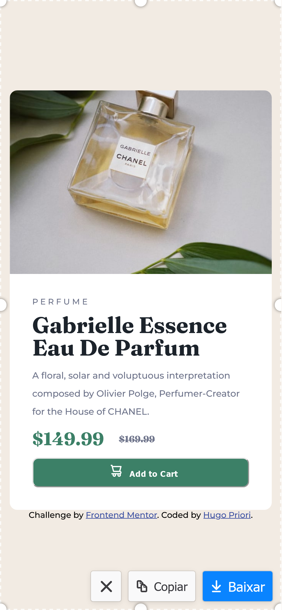

# Frontend Mentor - Product preview card component solution

This is a solution to the [Product preview card component challenge on Frontend Mentor](https://www.frontendmentor.io/challenges/product-preview-card-component-GO7UmttRfa). Frontend Mentor challenges help you improve your coding skills by building realistic projects. 

## Table of contents

- [Overview](#overview)
  - [The challenge](#the-challenge)
  - [Screenshot](#screenshot)
  - [Links](#links)
- [My process](#my-process)
  - [Built with](#built-with)
  - [What I learned](#what-i-learned)
  - [Continued development](#continued-development)
  - [Useful resources](#useful-resources)
- [Author](#author)
- [Acknowledgments](#acknowledgments)

**Note: Delete this note and update the table of contents based on what sections you keep.**

## Overview

### The challenge

Users should be able to:

- View the optimal layout depending on their device's screen size
- See hover and focus states for interactive elements

### Screenshot

### Links

- Solution URL: [Add solution URL here](https://your-solution-url.com)
- Live Site URL: [Add live site URL here](https://your-live-site-url.com)

## My process

### Built with

- Semantic HTML5 markup
- CSS custom properties
- Flexbox
### What I learned

This exercise was important to practice some basic knowledge about css and html, but most importantly, concepts about responsive design

### Continued development

My focus is to keep getting better at css, and learn a lot more about its properties in a real world scenario

### Useful resources

- [W3schools website](https://www.w3schools.com/) - Go to page to learn and search about css properties.
- [Curso em Video](https://www.youtube.com/watch?v=Ejkb_YpuHWs&list=PLHz_AreHm4dkZ9-atkcmcBaMZdmLHft8n) - Free html and css classes(in portuguese)

## Author
- Frontend Mentor - [@priorihugo](https://www.frontendmentor.io/profile/priorihugo)

## Acknowledgments

This is where you can give a hat tip to anyone who helped you out on this project. Perhaps you worked in a team or got some inspiration from someone else's solution. This is the perfect place to give them some credit.

**Note: Delete this note and edit this section's content as necessary. If you completed this challenge by yourself, feel free to delete this section entirely.**
